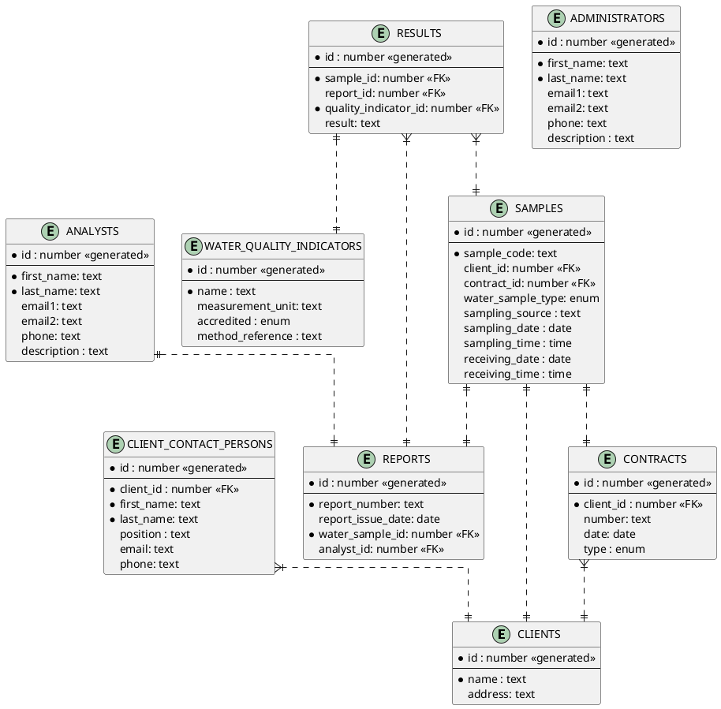

# Water samples analysis reports generation project

This API was created for learning purposes of Spring Boot and Java. 
The API uses an in-memory database managed by the H2 Database Engine.
Start the API by running the AnalysisReportApplication file.
Among the options to do:
 - search analysis reports by the following filters: issue date, client id, contract id, analyst id;
 - search for analysis results by: sample id, analysis report id, water quality indicator name;
 - search by partial name of contact person or client;
 - search water sample by client or contract id or by receiving date between;
 - partially update an entity's details.

   
**Notes**: 
1. An analysis report can have only a part of the quality indicators requested initially. 
2. Multiple (maybe not more than 2) analysis reports can be issued for the same sample; e.g., due to various errors on the first report that was already given to the client.

## Database schema

