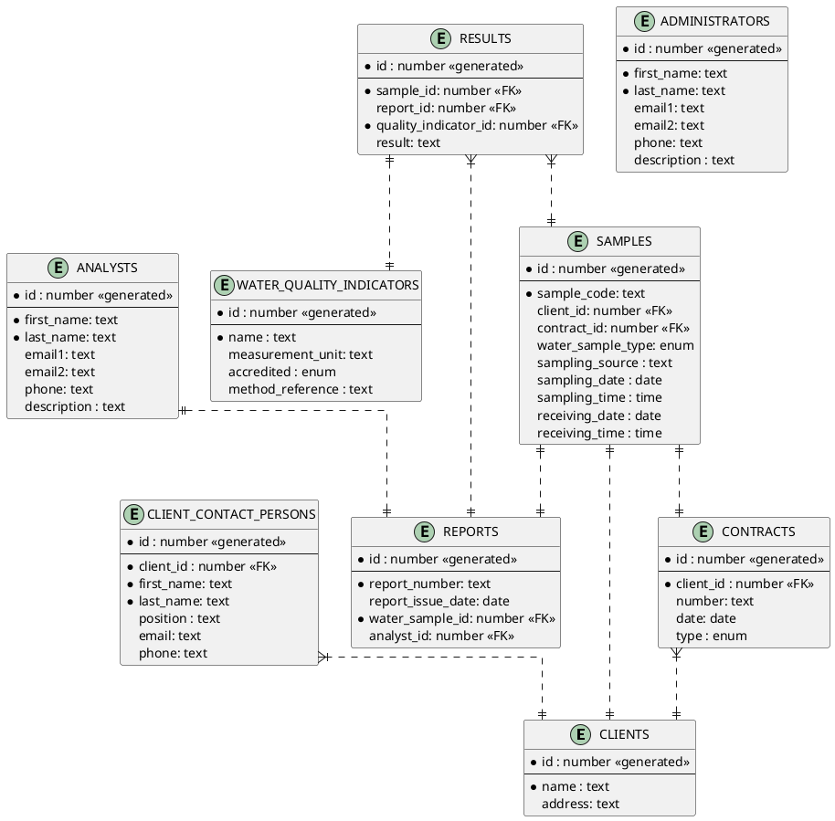

# Analysis Report API

## Overview
Water laboratories need to capture sampling details, track contractual context, and publish results in formal reports. This project provides a Spring Boot REST API that models that workflow end-to-end: clients sign contracts, samples are registered, indicators are configured, and reports/results are produced. The code base was created as a learning exercise and now serves as a full example of how to wire Spring Data JPA, custom queries, and request validation into a cohesive service.

## Key Capabilities
- CRUD flows for administrators, analysts, clients, contracts, water samples, quality indicators, and lab results
- Rich search operations: partial-name lookups, filtered report queries, and result searches by indicator name
- Seed data loaded via `CommandLineRunner` for immediate experimentation
- File-based H2 database for easy local persistence and SQL console access
- Consistent date/time formatting (`dd.MM.yyyy`, `HH:mm:ss`) enforced across request/response payloads

## Tech Stack
- Java 20
- Spring Boot 3.1 (web, data-jpa, validation)
- H2 Database (file mode)
- Lombok (DTO/entity boilerplate)
- Maven build tooling
- JUnit + Spring Boot Test starter

## Project Layout
```
src/main/java/com/example/analysisreport
|- admin | analyst | client | contact_person | contract
|  |- controller        REST endpoints
|  |- entity            JPA models
|  |- repository        Spring Data repositories
|- quality_indicator    CRUD + search for water quality indicators
|- report               Report CRUD + specification-based search
|- results              Result CRUD + native search implementation
|- water_sample         Sample lifecycle and date range searches
|- AnalysisReportApplication.java   Spring Boot entry point + seed data
```
Configuration lives in `src/main/resources/application.properties`.

## Getting Started
1. Install JDK 20 and Maven 3.9+.
2. Clone the repository and open it in your IDE (Lombok plugin required for getters/setters to compile inside the IDE).
3. Build once to download dependencies:
   ```bash
   mvn clean package
   ```
4. Run the application:
   ```bash
   mvn spring-boot:run
   ```
   The API starts on `http://localhost:8080`.

### Database & Console
- Default JDBC URL: `jdbc:h2:file:~/analysis_report_data.db`
- H2 console is enabled at `http://localhost:8080/h2-console`
- Schema is dropped/recreated on each run (`spring.jpa.hibernate.ddl-auto=create-drop`)

### Seed Data
`AnalysisReportApplication` implements `CommandLineRunner` and inserts sample clients, contact people, contracts, water samples, indicators, reports, and results. This makes the API usable immediately after startup for demos or manual testing.

## API Overview
All endpoints exchange JSON unless otherwise noted.

### Administration
| Method | Path | Description |
| ------ | ---- | ----------- |
| GET | `/api/v1/admins` | List administrators |
| POST | `/api/v1/admins/add` | Create administrator |
| PUT | `/api/v1/admins/update/{adminId}` | Partial update by ID |
| DELETE | `/api/v1/admins/delete/{adminId}` | Delete by ID |

### Analysts
| Method | Path | Description |
| ------ | ---- | ----------- |
| GET | `/api/v1/analysts` | List analysts |
| GET | `/api/v1/analysts/search?str=...` | Search description substring |
| POST | `/api/v1/analysts/add` | Create analyst |
| PUT | `/api/v1/analysts/update/{analystId}` | Partial update by ID |
| DELETE | `/api/v1/analysts/delete/{analystId}` | Delete by ID |

### Clients & Contacts
| Method | Path | Description |
| ------ | ---- | ----------- |
| GET | `/api/v1/clients` | List clients |
| GET | `/api/v1/clients/ascending` | List clients alphabetically |
| GET | `/api/v1/clients/{name}` | Search clients by partial name |
| GET | `/api/v1/clients/client/{id}` | Fetch client by ID |
| POST | `/api/v1/clients/add` | Create client |
| PUT | `/api/v1/clients/update/{clientId}` | Partial update by ID |
| DELETE | `/api/v1/clients/client/{id}` | Delete client |
| GET | `/api/v1/contact-persons` | List contact people |
| GET | `/api/v1/contact-persons/{clientName}` | Search contacts by client name |
| POST | `/api/v1/contact-persons/add/{clientId}` | Create contact person for client |
| PUT | `/api/v1/contact-persons/update/{contactPersonId}` | Partial update |
| DELETE | `/api/v1/contact-persons/delete/{contactPersonId}` | Delete contact person |

### Contracts
| Method | Path | Description |
| ------ | ---- | ----------- |
| GET | `/api/v1/contracts` | List contracts |
| GET | `/api/v1/contracts/{clientName}` | Filter contracts by client name |
| POST | `/api/v1/contracts/add/{clientId}` | Create contract linked to client |
| PUT | `/api/v1/contracts/update/{contractId}` | Partial update |
| DELETE | `/api/v1/contracts/delete/{contractId}` | Delete contract |

### Water Samples
| Method | Path | Description |
| ------ | ---- | ----------- |
| GET | `/api/v1/water-samples` | List samples |
| GET | `/api/v1/water-samples/search/{clientId}` | Samples for a client ID |
| GET | `/api/v1/water-samples/search/{contractId}` | Samples for a contract ID |
| GET | `/api/v1/water-samples/search?startDate=dd.MM.yyyy&endDate=dd.MM.yyyy` | Samples received in date range |
| POST | `/api/v1/water-samples/add/{clientId}` | Register sample for client |
| PUT | `/api/v1/water-samples/update/{sampleId}` | Partial update |
| DELETE | `/api/v1/water-samples/delete/{sampleId}` | Delete sample |

### Reports
| Method | Path | Description |
| ------ | ---- | ----------- |
| GET | `/api/v1/reports/get/all` | List reports |
| GET | `/api/v1/reports/get/{sampleId}` | Fetch report by water sample |
| POST | `/api/v1/reports/add` | Create report |
| POST | `/api/v1/reports/search` | Filter by issue dates, analyst, client, or contract |
| PUT | `/api/v1/reports/update/{reportId}` | Partial update using JSON merge |
| DELETE | `/api/v1/reports/delete/{reportId}` | Delete report |

### Quality Indicators & Results
| Method | Path | Description |
| ------ | ---- | ----------- |
| GET | `/api/v1/indicators` | List indicators |
| GET | `/api/v1/indicators/get/{name}` | Search indicators by partial name |
| POST | `/api/v1/indicators/add` | Create indicator |
| PUT | `/api/v1/indicators/update/{indicatorId}` | Partial update |
| DELETE | `/api/v1/indicators/delete/{indicatorId}` | Delete indicator |
| GET | `/api/v1/results/get/{resultId}` | Fetch lab result by ID |
| POST | `/api/v1/results/add` | Record result |
| POST | `/api/v1/results/search` | Filter results by sample/report ID and indicator name |
| PUT | `/api/v1/results/update/{resultId}` | Partial update |
| DELETE | `/api/v1/results/delete/{resultId}` | Delete result |

## Example Requests
Search reports issued in April 2022 for a specific analyst:
```bash
curl -X POST http://localhost:8080/api/reports/search \
  -H "Content-Type: application/json" \
  -d '{
        "startDate": "01.04.2022",
        "endDate": "30.04.2022",
        "analystId": 2
      }'
```

Find results for sample 1 that mention indicator Fe:
```bash
curl -X POST http://localhost:8080/api/results/search \
  -H "Content-Type: application/json" \
  -d '{
        "sampleId": 1,
        "qualityIndicatorName": "Fe"
      }'
```

Create a new quality indicator:
```bash
curl -X POST http://localhost:8080/api/indicators/add \
  -H "Content-Type: application/json" \
  -d '{
        "name": "pH",
        "measurementUnit": "",
        "accredited": "YES"
      }'
```

## Data Model
The ER diagram below mirrors the entity relationships. PlantUML is kept so you can regenerate the image with any PlantUML renderer.



## Troubleshooting
- If the application fails to start, verify that no other process occupies port 8080.
- For IDE compilation errors, ensure annotation processing is enabled so Lombok can generate getters/setters.
- Delete `analysis_report_data.db*` in your user home directory if you want a clean database between runs.

